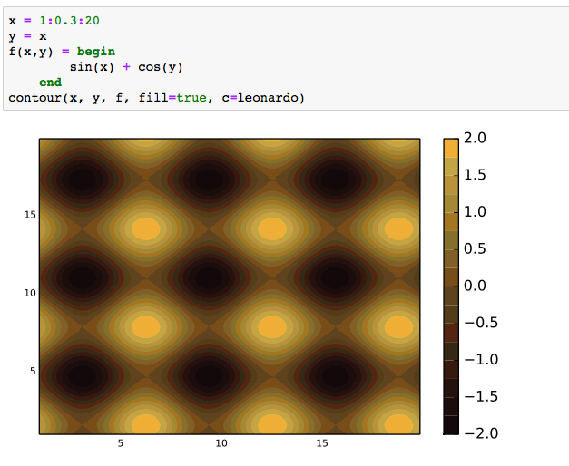
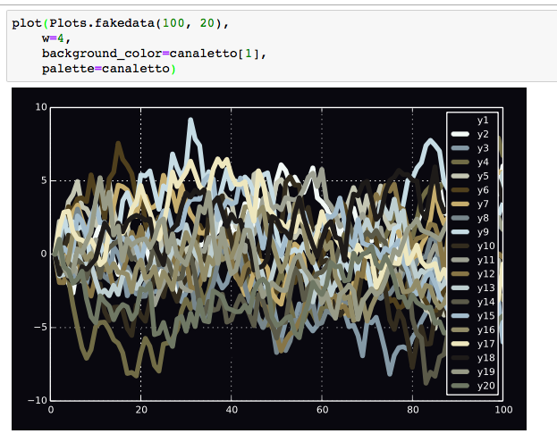

## ColorSchemes

This package provides tools for working with colorschemes and colormaps. As well as providing many pre-made colormaps and schemes, this package allows you to extract colorschemes from images and use them in plots or other graphics programs.

This package relies on the [Colors.jl](https://github.com/JuliaGraphics/Colors.jl) package and [Images.jl](https://github.com/JuliaImages/Images.jl).

### Contents

+ [Usage](#Usage)
+ [Basics](#Basics)
+ [ Colorschemes, blends/gradients](#Colorschemes, blends/gradients)
+ [ Sorting color schemes](#Sorting color schemes)
+ [ Making colorscheme files](#Making colorscheme files)
+ [ Weighted colorschemes](#Weighted colorschemes)
+ [Plotting](#Plotting)
+ [ Plots](#Plots.jl)
+ [ Gadfly](#Gadfly)
+ [ Winston](#Winston)
+ [ PyPlot](#PyPlot)
+ [Images](#Images)

### Usage 

To add this package:

    Pkg.add("ColorSchemes")

To use the basic functions in the package:

    using ColorSchemes

### Basics 

A colorscheme is an array of colors:

    32-element Array{RGB{Float64},1}:
        RGB{Float64}(0.0548203,0.016509,0.0193152)
        RGB{Float64}(0.0750816,0.0341102,0.0397083)
        RGB{Float64}(0.10885,0.0336675,0.0261204)
        RGB{Float64}(0.100251,0.0534243,0.0497594)
        ...
        RGB{Float64}(0.85004,0.540122,0.136212)
        RGB{Float64}(0.757552,0.633425,0.251451)
        RGB{Float64}(0.816472,0.697015,0.322421)
        RGB{Float64}(0.933027,0.665164,0.198652)
        RGB{Float64}(0.972441,0.790701,0.285136)

The names of the built-in colorschemes are stored in the `schemes` array:

    julia> schemes
    336-element Array{Symbol,1}:
    :alpine         
    :aquamarine     
    :army           
    :atlantic       
    :aurora         
    :autumn         
    :avocado        
    :beach          
    :blackbody      
    ...
    :PiYG_10        
    :PiYG_11        
    :magma          
    :inferno        
    :plasma         
    :viridis

To access one of these built-in colorschemes, use its symbol:

    julia> ColorSchemes.leonardo

    32-element Array{RGB{Float64},1}:
     RGB{Float64}(0.0548203,0.016509,0.0193152)
     RGB{Float64}(0.0750816,0.0341102,0.0397083)
     RGB{Float64}(0.10885,0.0336675,0.0261204)
     RGB{Float64}(0.100251,0.0534243,0.0497594)
     ...
     RGB{Float64}(0.620187,0.522792,0.216707)
     RGB{Float64}(0.692905,0.56631,0.185515)
     RGB{Float64}(0.681411,0.58149,0.270391)
     RGB{Float64}(0.85004,0.540122,0.136212)
     RGB{Float64}(0.757552,0.633425,0.251451)
     RGB{Float64}(0.816472,0.697015,0.322421)
     RGB{Float64}(0.933027,0.665164,0.198652)
     RGB{Float64}(0.972441,0.790701,0.285136)

By default, the names of the colorschemes aren't imported (there _are_ rather a lot of them). But to avoid using the prefixes, you can import the ones that you want:

    julia> import ColorSchemes.leonardo
    julia> leonardo
    32-element Array{RGB{Float64},1}:
     RGB{Float64}(0.0548203,0.016509,0.0193152)
     RGB{Float64}(0.0750816,0.0341102,0.0397083)
     RGB{Float64}(0.10885,0.0336675,0.0261204)
     RGB{Float64}(0.100251,0.0534243,0.0497594)
     ...
     RGB{Float64}(0.757552,0.633425,0.251451)
     RGB{Float64}(0.816472,0.697015,0.322421)
     RGB{Float64}(0.933027,0.665164,0.198652)
     RGB{Float64}(0.972441,0.790701,0.285136)

You can reference a single value of a scheme once it's loaded:

    leonardo[3]

    -> RGB{Float64}(0.10884977211887092,0.033667530751245296,0.026120424375656533)

Or you can 'sample' the scheme at any point between 0 and 1 using `get`:

    get(leonardo, 0.5)

    -> RGB{Float64}(0.42637271063618504,0.28028983973265065,0.11258024276603132)

You can extract a colorscheme from an image. For example, here's an image of a famous painting:

Use `extract()` to create a colorscheme from the original image:

    monalisa = extract("monalisa.jpg", 10, 15, 0.01; shrink=2)

which in this example creates a 10-color scheme (using 15 iterations and with a tolerance of 0.01; the image can be reduced in size, here by 2, before processing, to save time).

    10-element Array{RGB{Float64},1}:
    RGB{Float64}(0.0406901,0.0412985,0.0423865),
    RGB{Float64}(0.823493,0.611246,0.234261),
    RGB{Float64}(0.374688,0.363066,0.182004),
    RGB{Float64}(0.262235,0.239368,0.110915),
    RGB{Float64}(0.614806,0.428448,0.112495),
    RGB{Float64}(0.139384,0.124466,0.0715472),
    RGB{Float64}(0.627381,0.597513,0.340734),
    RGB{Float64}(0.955276,0.775304,0.37135),
    RGB{Float64}(0.497517,0.4913,0.269587),
    RGB{Float64}(0.880421,0.851357,0.538013),
    RGB{Float64}(0.738879,0.709218,0.441082)]

(Extracting colorschemes from images requires image importing and exporting abilities. These are platform-specific. On Linux/UNIX, ImageMagick can be used for importing and exporting images.)

The ColorSchemes module automatically loads a number of predefined schemes, shown in the following illustration. Each scheme is drawn in three ways: first, showing each color; next, a continuous blend obtained using `get()` with values ranging from 0 to 1 (stepping through the range `0:0.001:1`); and finally a luminance graph shows how the luminance of the scheme varies as the colors change.

It's generally agreed (search the web for "Rainbow colormaps considered harmful") that you should choose colormaps with smooth linear luminance gradients.

(You can generate this file using `ColorSchemes/doc/draw-swatches.jl`, after obtaining the Luxor package to draw and label things.)

You can list the names of built-in colorschemes in the `ColorSchemes/data` directory by looking in the `schemes` symbol. Look for matches with `filter()`.

    julia> filter(x-> contains(string(x), "temp"), schemes)
    2-element Array{Symbol,1}:
     :lighttemperaturemap
     :temperaturemap

    julia> filter(x-> ismatch(r"ma.*", string(x)), schemes)
    5-element Array{Symbol,1}:
    :aquamarine         
    :lighttemperaturemap
    :temperaturemap     
    :magma              
    :plasma       

Of course you can easily make your own colorscheme by building an array:

    grays = [RGB{Float64}(i, i, i) for i in 0:0.1:1.0]

or, slightly longer:

    reds = RGB{Float64}[]

    for i in 0:0.05:1
      push!(reds, RGB{Float64}(1, 1-i, 1-i))
    end

## Colorschemes, blends/gradients 

You can access the specific colors of a colorscheme by indexing (eg `leonardo[2]` or `leonardo[2:20]`). Or you can sample a colorscheme at a point between 0.0 and 1.0 as if it was a continuous range of colors:

    get(leonardo, 0.5)

returns

    RGB{Float64}(0.42637271063618504,0.28028983973265065,0.11258024276603132)

The colors in the predefined colorschemes are usually sorted by LUV luminance, so this often makes sense.

## Sorting color schemes 

Use `sortcolorscheme()` to sort a scheme non-destructively in the LUV color space:

    sortcolorscheme(ColorSchemes.leonardo)
    sortcolorscheme(ColorSchemes.leonardo, rev=true)

The default is to sort colors by their LUV luminance value, but you could try specifying the `:u` or `:v` LUV fields instead (sorting colors is another problem domain not really addressed in this package...):

    sortcolorscheme(colorscheme, :u)

## Weighted colorschemes 

Sometimes an image is dominated by some colors with others occurring less frequently. For example, there may be much more brown than yellow in a particular image. A colorscheme derived from this image can reflect this. You can extract both a set of colors and a set of numerical values or weights that indicate the proportions of colors in the image.

    using Images
    cs, wts = extract_weighted_colors("monalisa.jpg", 10, 15, 0.01; shrink=2)

The colorscheme is now in `cs`, and `wts` holds the various weights of each color:

    wts
    -> 10-element Array{Float64,1}:
     0.294055
     0.0899108
     0.0808455
     0.0555576
     0.142818
     0.0356599
     0.0391717
     0.112667
     0.0596559
     0.0896584

With the colorscheme and the weights, you can make a colorscheme in which the more common colors take up more space in the scheme:

    colorscheme_weighted(cs, wts, len)

Or in one go:

    colorscheme_weighted(extract_weighted_colors("monalisa.jpg")...)

Compare the weighted and unweighted versions of schemes extracted from the Hokusai image "The Great Wave":

## Plotting 

#### Plots 

Tom Breloff's amazing superplotting package, [Plots.jl](https://github.com/tbreloff/Plots.jl) can use colorschemes.

With the `contour()` function, use `cgrad()` to read the colorscheme as a gradient. This renaissance-looking plot uses the `leonardo` scheme:

    using Plots, Colorschemes

    x = 1:0.3:20
    y = x
    f(x,y) = begin
          sin(x) + cos(y)
      end
    contour(x, y, f, fill=true, seriescolor=cgrad(ColorSchemes.leonardo))

(You can use `c` as a short cut for `seriescolor`.)

With other plots, use the `palette` keyword:

    plot(Plots.fakedata(100, 20),
        w=4,
        background_color=ColorSchemes.vermeer[1],
        palette=ColorSchemes.vermeer)

You can list all colorschemes with a set of PyPlot heatmap plots:

    pyplot()
    z = (1:10)*(1:33)'
    map(cs -> PlotUtils.register_gradient_colors(Symbol(cs), eval(ColorSchemes, cs)), schemes);
    cschemes = keys(PlotUtils._gradients)
    plot([heatmap(z,fc=cm,leg=false,title=cm,ticks=nothing, titlefont = font(8)) for cm=cschemes]..., size=(1500,1500))

#### Gadfly 

Here's how you can use ColorSchemes in Gadfly:

    x = repeat(collect(1:20), inner=[20])
    y = repeat(collect(1:20), outer=[20])
    plot(x=x, y=y,
        color=x+y,
        Geom.rectbin,
        Scale.ContinuousColorScale(p -> get(ColorSchemes.sunset, p)))

#### Winston 

If you prefer Winston.jl for plotting, you can use colorschemes with `imagesc`:

    using Winston
    klimt = ColorSchemes.klimt
    Winston.colormap(klimt)
    Winston.imagesc(reshape(1:10000,100,100))

Sometimes you'll want a smoother gradient with more colors. You can use `get(scheme, n)` to generate a more detailed array of colors, varying `n` from 0 to 1 by 0.001:

    brasstones = ColorSchemes.brass
    brasstonesmooth = [get(brasstones, i) for i in 0:0.001:1]
    Winston.colormap(brasstonesmooth)
    Winston.imagesc(reshape(1:10000,100,100))

#### PyPlot 

Colorschemes can be used with the `cmap` keyword in PyPlot:

    using PyPlot, Distributions

    solar = ColorSchemes.solar

    n = 100
    x = linspace(-3, 3, n)
    y = linspace(-3,3,n)

    xgrid = repmat(x',n,1)
    ygrid = repmat(y,1,n)
    z = zeros(n,n)

    for i in 1:n
        for j in 1:n
            z[i:i,j:j] = pdf(MvNormal(eye(2)),[x[i];y[j]])
        end
    end

    fig = PyPlot.figure("pyplot_surfaceplot",figsize=(10,10))
    ax = fig[:add_subplot](2,1,1, projection = "3d")
    ax[:plot_surface](xgrid, ygrid, z, rstride=2,edgecolors="k",
        cstride=2,
        cmap=ColorMap(solar),
        alpha=0.8,
        linewidth=0.25)

### Saving colorschemes as images ###

Sometimes you want to save a colorscheme, which is usually just a pixel thick, as an image. You can do this with `colorscheme_to_image()`. The second argument is the number of repetitions of each color in the row, the third is the total number of rows. The function returns an image which you can save using FileIO's `save()`:

    using FileIO, ColorSchemes, Images, Colors

    img = colorscheme_to_image(ColorSchemes.vermeer, 30, 400)
    save("/tmp/cs_vermeer-30-300.png", img)

#### Colorschemes to text files ###

You can save a colorscheme as a text file with the imaginatively-titled `colorscheme_to_text()` function. 

    colorscheme_to_text(ColorSchemes.vermeer, "the_lost_vermeer", "/tmp/the_lost_vermeer.jl")

The file is basically a Julia file with the color values preceded by a valid symbol name and the `@reg` macro. When this file is loaded into Julia (using `include()`), the scheme is added to the list of available schemes in `schemes`.

    # created 2017-02-07T18:30:38.021
    @reg the_lost_vermeer [
    RGB{Float64}(0.045319841827409044,0.04074539053177987,0.033174030819406126),
    RGB{Float64}(0.06194243196273512,0.05903050212040492,0.05139710689483695),
    RGB{Float64}(0.08816176863597491,0.0835588842566198,0.07360482587419233),
    ...
    RGB{Float64}(0.9481923826365111,0.8763149891872409,0.5495049783744819),
    RGB{Float64}(0.9564577470648753,0.8846308778140886,0.7723396650326797),
    RGB{Float64}(0.9689316860465117,0.9673077588593577,0.9478145764119602) ]

## Images ## 

Here's how you can use colorschemes when creating images with Images.jl. The code creates a Julia set and uses a colorscheme extracted from Vermeer's painting "Girl with a Pearl Earring".

    using ColorSchemes, Images

    function julia(z, c, maxiter::Int64)
        for n = 1:maxiter
            if abs(z) > 2
                return n
            end
            z = z^2 + c
        end
        return maxiter
    end

    # convert a value between oldmin/oldmax to equivalent value between newmin/newmax
    remap(value, oldmin, oldmax, newmin, newmax) = ((value - oldmin) / (oldmax - oldmin)) * (newmax - newmin) + newmin

    function draw(c, imsize;
          xmin = -2, ymin = -2, xmax  =  2, ymax = 2,
          filename = "/tmp/julia-set.png")
        imOutput = zeros(RGB{Float32}, imsize, imsize)
        maxiterations = 200
        for col = linspace(xmin, xmax, imsize)
            for row = linspace(ymin, ymax, imsize)
                pixelcolor = julia(complex(row, col), c, maxiterations) / 256
                xpos = convert(Int, round(remap(col, xmin, xmax, 1, imsize)))
                ypos = convert(Int, round(remap(row, ymin, ymax, 1, imsize)))
                imOutput[xpos, ypos] = get(ColorSchemes.vermeer, pixelcolor)
            end
        end
        FileIO.save(filename, imOutput)
    end

    draw(-0.4 + 0.6im, 1200)
