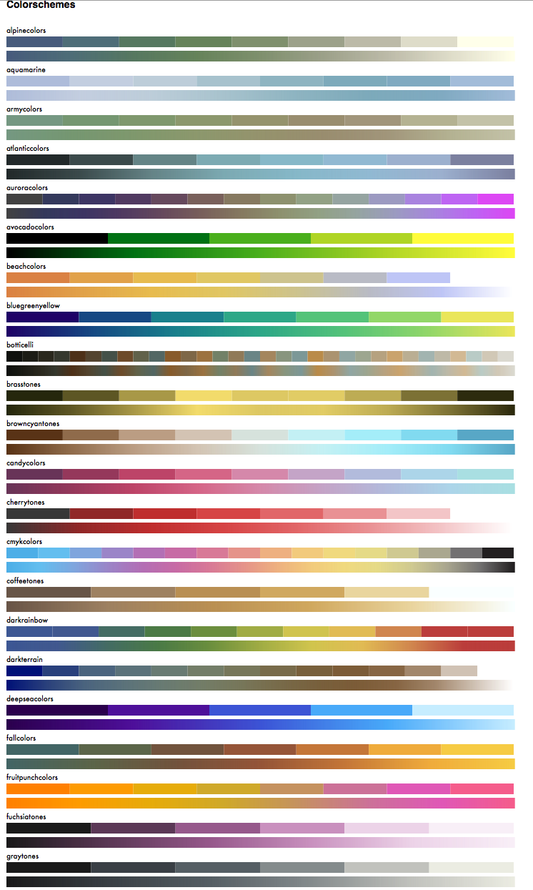
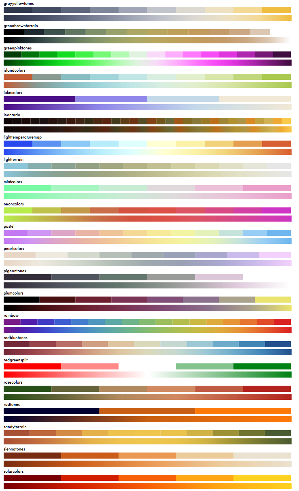
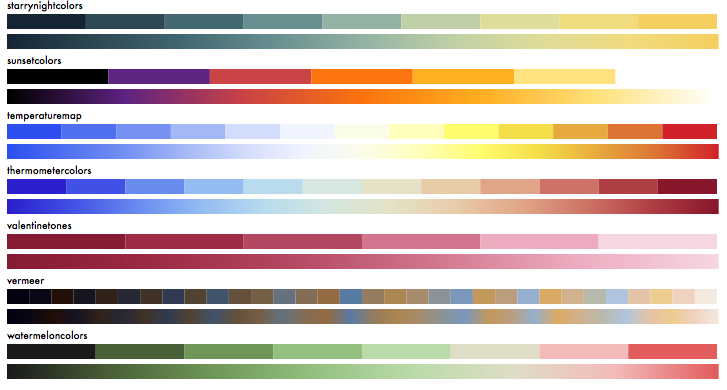

## ColorSchemes

You can use the excellent [Colors.jl](https://github.com/JuliaGraphics/Colors.jl) package for working with colors, and for producing  palettes that provide colors carefully chosen for readability and communication.

Sometimes, however, you don't always want readability. You might want a _colorscheme_ — a group of interesting colors — rather than a color palette. This package provides a very simple approach to working with colorschemes.

Needs: Images.jl, Colors.jl.

### Basics

A colorscheme is just an array of colors. Here's one:

    const alpine_colors = [
        RGB(0.277546,0.355398,0.484215),
        RGB(0.304739,0.42573,0.46747),
        RGB(0.495398,0.562531,0.427457),
        RGB(0.610225,0.62717,0.537364),
        RGB(0.735256,0.728382,0.656772),
        RGB(0.867237,0.859925,0.784232),
        RGB(1.,0.997467,0.914244)]

You can extract the colors from an image to create a new color scheme. For example, here's a famous painting:

To create a colorscheme from this image:

    monalisa = extract("monalisa.jpg", 10, 15, 0.01; shrink=2)

which creates a 10-color scheme (after 15 iterations and with a tolerance of 0.01; the image can be reduced
in size before processing to save time).

    10-element Array{ColorTypes.RGB{Float64},1}:
     RGB{Float64}(0.0465302,0.0466217,0.0477755)
     RGB{Float64}(0.695769,0.502293,0.165606)
     RGB{Float64}(0.890576,0.833807,0.492074)
     RGB{Float64}(0.481471,0.355741,0.108024)
     RGB{Float64}(0.445139,0.450331,0.24395)
     RGB{Float64}(0.889475,0.688348,0.29377)
     RGB{Float64}(0.161839,0.144967,0.0806486)
     RGB{Float64}(0.736354,0.706571,0.441564)
     RGB{Float64}(0.292996,0.2819,0.137832)
     RGB{Float64}(0.612204,0.586307,0.332992)

Or you can load an existing colorscheme from the ColorSchemes/data directory:

    loadcolorscheme("leonardo")

loads the colorscheme accessed via the constant `leonardo`.

Here's a list of the current colorschemes. For each scheme, first are the contents as is, next is the continuous blends obtained using `colorscheme()`:

Here's an <a href="doc/colorschemes.svg"> SVG</a> of them.

## Colorschemes, blends/gradients

As well as accessing a color by indexing (eg `leonardo[2]`), a colorscheme can also simulate a continuous range of color choices, by handling any number between 0 and 1.

    colorscheme(leonardo, 0.5)

returns

    RGB{Float64}(0.42637271063618504,0.28028983973265065,0.11258024276603132)

## Sorting color schemes

Sort a colorscheme:

    sortcolorscheme(cscheme)

## Making colorscheme files

Make a colorscheme file like this:

    make_colorschemefile("monalisa", leonardo)

which creates a file of that name in your current directory.

## Weighted colorschemes

Sometimes the different percentages of colors can affect the colorscheme. For example, there may
be much more brown than yellow. So you can extract both a set of colors and a set of numbers
that indicate proportions of colors. For example:

    cs, wts = extract_weighted_colors("monalisa.jpg", 10, 15, 0.01; shrink=2))

The colorscheme is in `cs`, and `wts` holds the ratios of each color:

    wts
    -> 10-element Array{Float64,1}:
     0.294055
     0.0899108
     0.0808455
     0.0555576
     0.142818
     0.0356599
     0.0391717
     0.112667
     0.0596559
     0.0896584

With these, you can make another colorscheme that repeats the colors according to the weights:

    colorscheme_weighted(cs, wts, length)

returns a new colorscheme where the proportion of each color reflect the weights.

Alternatively:

    colorscheme_weighted(extract_weighted_colors("hokusai.jpg")...)

Here's how you could use colorschemes in Gadfly:

