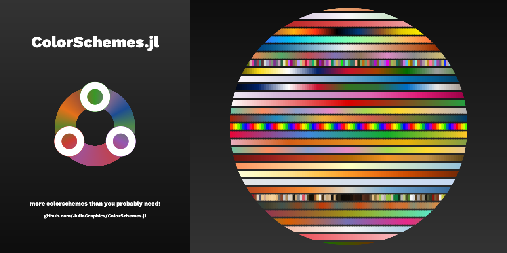

| **Documentation**                       | **Build Status**                           | **Code Coverage**               |
|:--------------------------------------- |:-------------------------------------------|:-------------------------------:|
|[![][docs-current-img]][docs-current-url]| [![Build Status][ci-img]][ci-url]          | [![][codecov-img]][codecov-url] |



## ColorSchemes

This package provides a collection of colorschemes:

- scientifically devised colorschemes from ColorBrewer, CMOcean, ScientificColorMaps, ColorCet, and Seaborn
- popular old favourites such as _viridis_, _inferno_, and _magma_ from MATPlotLib
- old masters' colorschemes, such as _leonardo_, _vermeer_, and _picasso_
- variously themed colorschemes such as _sunset_, _coffee_, _neon_, and _pearl_

Note that the schemes contained here are a mixture:

- some are high quality color maps with consistent perceptual contrast over their full range
- others are designed for general purpose and informal graphics work

Choose colorschemes with care! Refer to Peter Kovesi's [PerceptualColourMaps](https://github.com/peterkovesi/PerceptualColourMaps.jl) package, or to Fabio Crameri's [Scientific Colour Maps](http://www.fabiocrameri.ch/colourmaps.php) for more information.

If you want to make more advanced ColorSchemes, use linear-segment dictionaries or indexed lists, and use functions to generate color values, see the `make_colorscheme()` function in the [ColorSchemeTools.jl](https://github.com/JuliaGraphics/ColorSchemeTools.jl) package.

## Basic usage

```julia
] add ColorSchemes

using ColorSchemes

ColorSchemes.Purples_5 
# => a ColorScheme 

colorschemes[:Purples_5]
# => a ColorScheme 

ColorSchemes.Purples_5.colors
# => array of five RGB colors

ColorSchemes.Purples_5.colors[3]
# => the third color in the colorscheme

get(ColorSchemes.Purples_5, 0.5)
# => the midway point of the colorscheme

colorschemes
# => Dict{Symbol, ColorScheme} with 983 entries

findcolorscheme("purple")
# => display list of matching schemes
```

[docs-current-img]: https://img.shields.io/badge/docs-current-blue.svg
[docs-current-url]: https://JuliaGraphics.github.io/ColorSchemes.jl/dev/

[codecov-img]: https://codecov.io/gh/JuliaGraphics/ColorSchemes.jl/branch/master/graph/badge.svg
[codecov-url]: https://codecov.io/gh/JuliaGraphics/ColorSchemes.jl

[ci-img]: https://github.com/JuliaGraphics/ColorSchemes.jl/workflows/CI/badge.svg
[ci-url]: https://github.com/JuliaGraphics/ColorSchemes.jl/actions?query=workflow%3ACI
