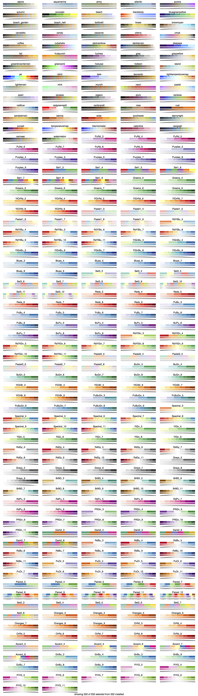
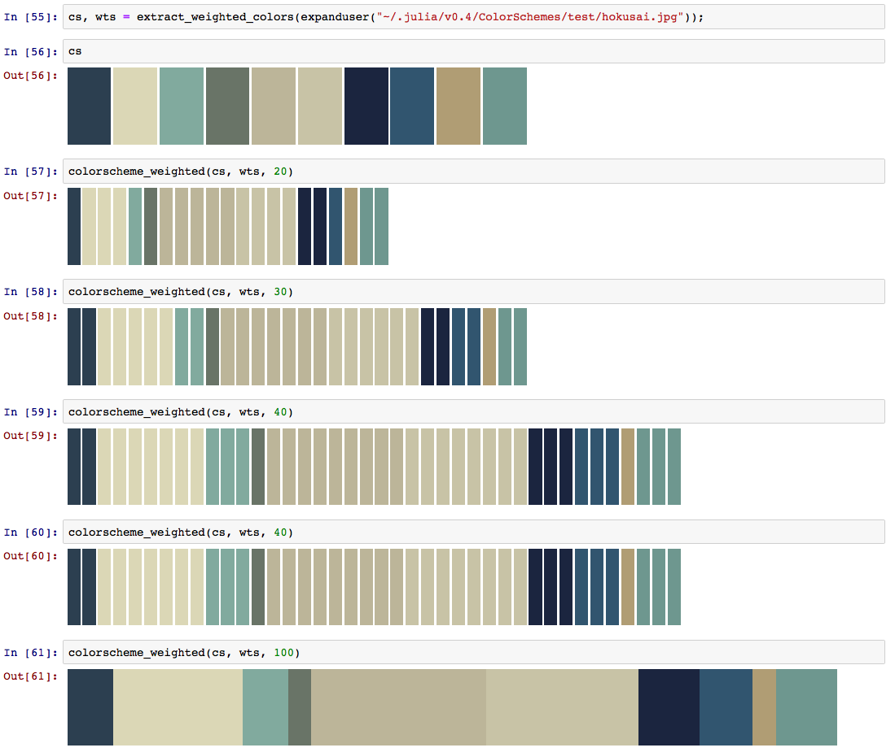
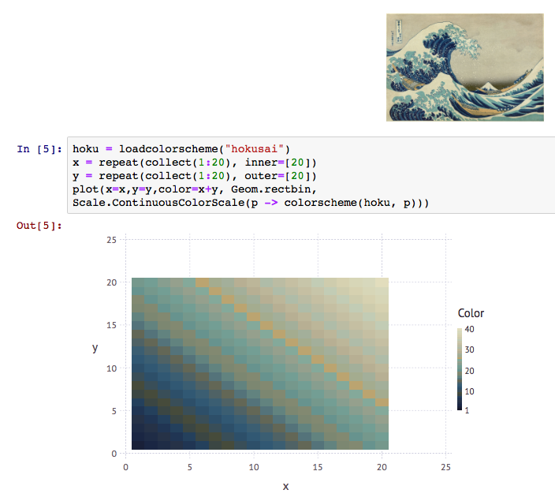
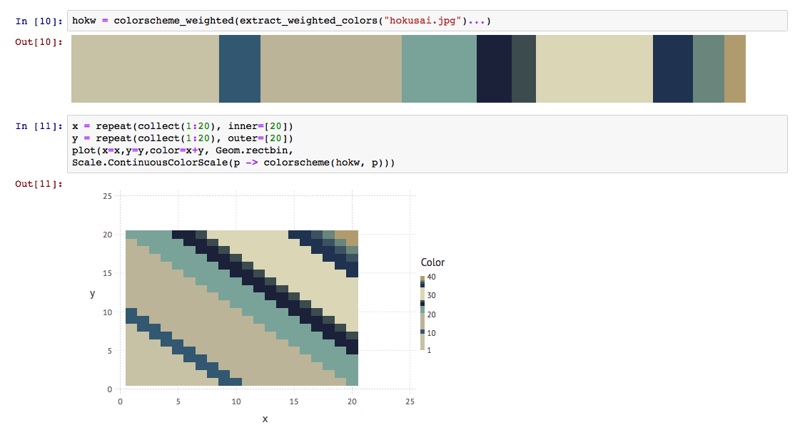
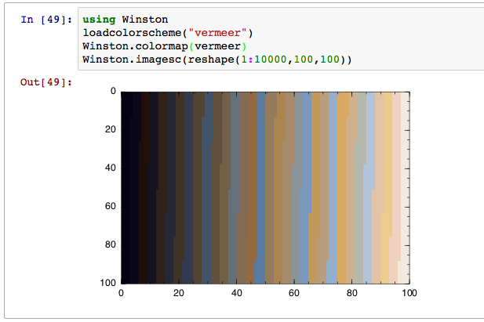
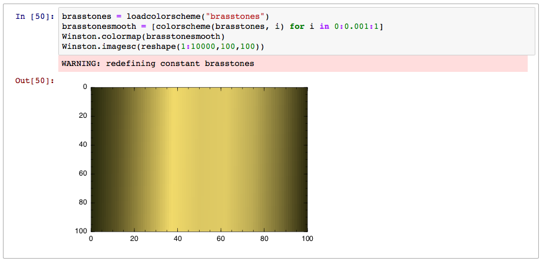
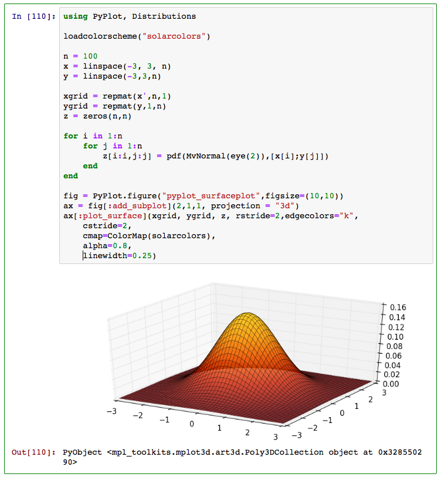
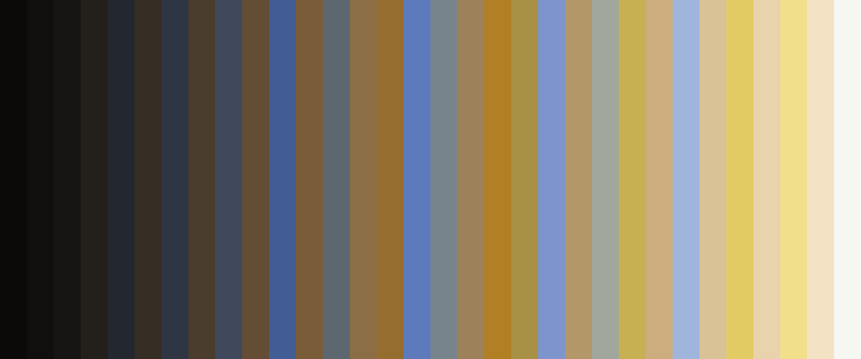

## ColorSchemes

### Contents

+ [Usage](#Usage)
+ [Basics](#Basics)
+  [Colorschemes, blends/gradients](#Colorschemes, blends/gradients)
+  [Sorting color schemes](#Sorting color schemes)
+  [Making colorscheme files](#Making colorscheme files)
+  [Weighted colorschemes](#Weighted colorschemes)
+ [Plotting](#Plotting)
+  [Gadfly](#Gadfly)
+  [Winston](#Winston)
+  [PyPlot](#PyPlot)
+ [Images](#Images)

You can use the excellent [Colors.jl](https://github.com/JuliaGraphics/Colors.jl) package for working with colors, and for producing palettes that provide colors carefully chosen for readability and communication.

Sometimes, however, you might want a _colorscheme_ — a group of interesting colors that complement each other visually — rather than a color palette. This package provides a very simple approach to working with colorschemes.

### Usage 

To add this package (to Julia 0.4+):

    Pkg.clone("git://github.com/cormullion/ColorSchemes.jl.git")

To use the package:

    using ColorSchemes, Colors

Some functions require you to have Images.jl and Clustering.jl installed as well.

You might also like:

- [ColorBrewer.jl](https://github.com/timothyrenner/ColorBrewer.jl)

- [NoveltyColors.jl](https://github.com/randyzwitch/NoveltyColors.jl)

### Basics 

A colorscheme is an array of colors:

    32-element Array{ColorTypes.RGB{Float64},1}:
     RGB{Float64}(0.0548203,0.016509,0.0193152)
     RGB{Float64}(0.0750816,0.0341102,0.0397083)
     RGB{Float64}(0.10885,0.0336675,0.0261204)
     RGB{Float64}(0.100251,0.0534243,0.0497594)
     ...
     RGB{Float64}(0.85004,0.540122,0.136212)
     RGB{Float64}(0.757552,0.633425,0.251451)
     RGB{Float64}(0.816472,0.697015,0.322421)
     RGB{Float64}(0.933027,0.665164,0.198652)
     RGB{Float64}(0.972441,0.790701,0.285136)

You can load a predefined scheme (from the `ColorSchemes/data` directory) using:

    leonardo = loadcolorscheme("leonardo")

— the `.txt` suffix can be omitted.

You can reference a single value of this scheme:

    leonardo[3]

    -> RGB{Float64}(0.10884977211887092,0.033667530751245296,0.026120424375656533)

Or you can 'sample' it at any point between 0 and 1:

    colorscheme(leonardo, 0.5)

    -> RGB{Float64}(0.42637271063618504,0.28028983973265065,0.11258024276603132)

You can create a new color scheme by sampling an image. For example, here's an image of a famous painting:

Use `extract()` to create a colorscheme from this image:

    monalisa = extract("monalisa.jpg", 10, 15, 0.01; shrink=2)

which creates a 10-color scheme (using 15 iterations and with a tolerance of 0.01; the image can be reduced in size, here by 2, before processing, to save time).

    10-element Array{ColorTypes.RGB{Float64},1}:
     RGB{Float64}(0.0465302,0.0466217,0.0477755)
     RGB{Float64}(0.695769,0.502293,0.165606)
     RGB{Float64}(0.890576,0.833807,0.492074)
     RGB{Float64}(0.481471,0.355741,0.108024)
     RGB{Float64}(0.445139,0.450331,0.24395)
     RGB{Float64}(0.889475,0.688348,0.29377)
     RGB{Float64}(0.161839,0.144967,0.0806486)
     RGB{Float64}(0.736354,0.706571,0.441564)
     RGB{Float64}(0.292996,0.2819,0.137832)
     RGB{Float64}(0.612204,0.586307,0.332992)

The ColorSchemes/data directory contains a number of predefined schemes. In the following illustration, first is shown the contents of a colorscheme, followed by a continuous blend obtained using `colorscheme()` and values ranging from 0 to 1 (stepping through the range `0:0.001:1`):

Here's an <a href="doc/colorschemes.svg"> SVG</a> of them.

You can list them with `list()`.

## Colorschemes, blends/gradients 

As well as accessing colors by indexing (eg `leonardo[2]` or `leonardo[2:20]`), a colorscheme can also simulate a continuous range of color choices, by handling any number between 0 and 1 and interpolating between the available colors. So:

    colorscheme(leonardo, 0.5)

returns

    RGB{Float64}(0.42637271063618504,0.28028983973265065,0.11258024276603132)

## Sorting color schemes 

To sort a colorscheme:

    sortcolorscheme(cscheme)

or

    sortcolorscheme(leonardo, rev=true)

The default is to sort colors by their LUV luminance value, but you could try the `:u` or `:v` LUV fields (sorting colors is another problem domain not really addressed here...):

    sortcolorscheme(colorscheme, :u)

## Making colorscheme files 

You can make a colorscheme file from a colorscheme like this:

    savecolorscheme(leonardo, "/tmp/leonardo_scheme.txt", "comment: from the Mona Lisa")

which saves the color values in a text file with the provided name. The file contains one or more lines of three Float64 numbers between 0 and 1, for Red, Green, and Blue. A comment line can be added.

## Weighted colorschemes 

Sometimes a colorscheme is dominated by some colors, and others occur less frequently. For example, in an image there may be much more brown than yellow. You can extract both a set of colors and a set of weights that indicate proportions of colors. For example:

    cs, wts = extract_weighted_colors("monalisa.jpg", 10, 15, 0.01; shrink=2)

The colorscheme is in `cs`, and `wts` holds the proportions of each color:

    wts
    -> 10-element Array{Float64,1}:
     0.294055
     0.0899108
     0.0808455
     0.0555576
     0.142818
     0.0356599
     0.0391717
     0.112667
     0.0596559
     0.0896584

With these, you can make a weighted colorscheme that repeats the colors according to the weights:

    colorscheme_weighted(cs, wts, len)

Here, the proportion of each color reflect the weights in the original.

Alternatively:

    colorscheme_weighted(extract_weighted_colors("monalisa.jpg")...)

## Plotting 

#### Gadfly 

Here's how you could use colorschemes in Gadfly:

#### Winston 

If you use Winston, you can use colorschemes with `imagesc`:

Sometimes you'll need a smoother gradient with more colors. You can use `colorscheme(scheme, n)` to generate a more detailed array:

Unfortunately, when doing array comprehensions, the type information sometimes goes missing, hence the  `Array{ColorTypes.RGB}(` before the comprehension here.

#### PyPlot 

The colorschemes defined here can be used with the `cmap` keyword in PyPlot:

## Images 

Here's how you can use colorschemes with Images.jl. The Julia set uses colors extracted from Vermeer's painting "Girl with a Pearl Earring" (loaded using `loadcolorscheme("vermeer")`).

    using Images, FileIO, Colors, ColorSchemes

    function julia(z, c, maxiter::Int64)
        for n = 1:maxiter
            if abs(z) > 2
                return n
            end
            z = z^2 + c
        end
        return maxiter
    end

    # convert a value between oldmin/oldmax to equivalent value between newmin/newmax
    remap(value, oldmin, oldmax, newmin, newmax) = ((value - oldmin) / (oldmax - oldmin)) * (newmax - newmin) + newmin

    function draw(c, size;
          xmin = -2, ymin = -2, xmax  =  2, ymax = 2,
          filename = "/tmp/julia-set.png")
        array = Array{UInt8}(size, size, 3)
        vermeer_pearl = loadcolorscheme("vermeer")
        imOutput = colorim(array)
        maxiterations = 200
        for col = linspace(xmin, xmax, size)
            for row = linspace(ymin, ymax, size)
                pixelcolor = julia(complex(row, col), c, maxiterations) /256
                xpos = convert(Int, round(remap(col, xmin, xmax, 1, size)))
                ypos = convert(Int, round(remap(row, ymin, ymax, 1, size)))
                imOutput.data[xpos, ypos, :] = [
                  (colorscheme(vermeer_pearl,pixelcolor).r),
                  (colorscheme(vermeer_pearl,pixelcolor).g),
                  (colorscheme(vermeer_pearl,pixelcolor).b)]
            end
        end
        save(filename, imOutput)
    end

    draw(-0.4 + 0.6im, 1200)

Sometimes you want to save a colorscheme, usually just a pixel high, as an image. You can do this with `colorscheme_to_image()`. The second argument is the number of repetitions for each color, the third is the number of rows. The function returns an image which you can save using FileIO's `save()`:

    (using FileIO, ColorSchemes, Images, Colors)

    vermeer_pearl = loadcolorscheme("vermeer")
    img = colorscheme_to_image(vermeer_pearl, 30, 400)
    save("/tmp/cs_vermeer-30-300.png", img)

