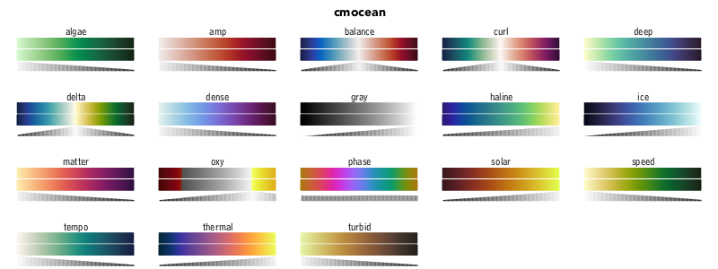
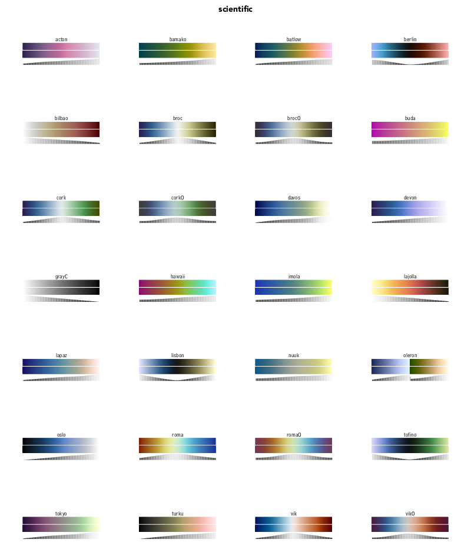
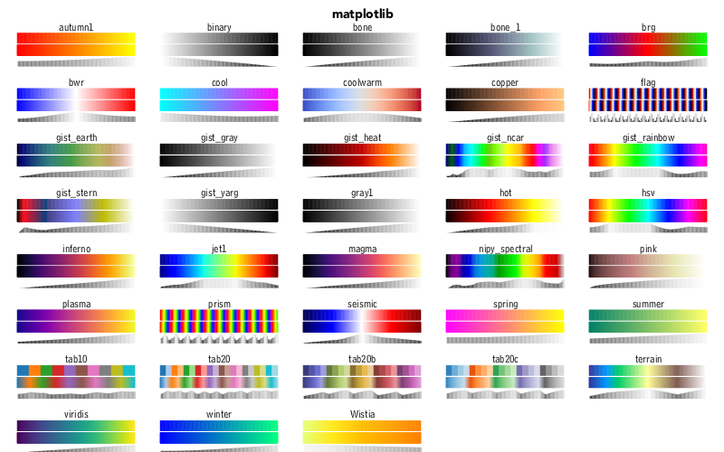
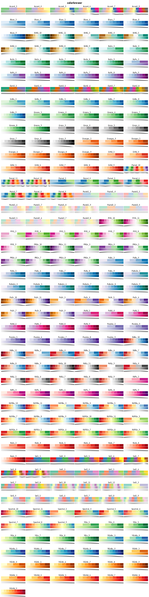
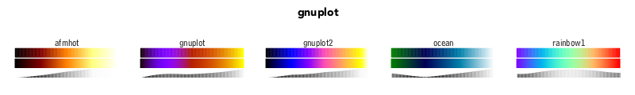
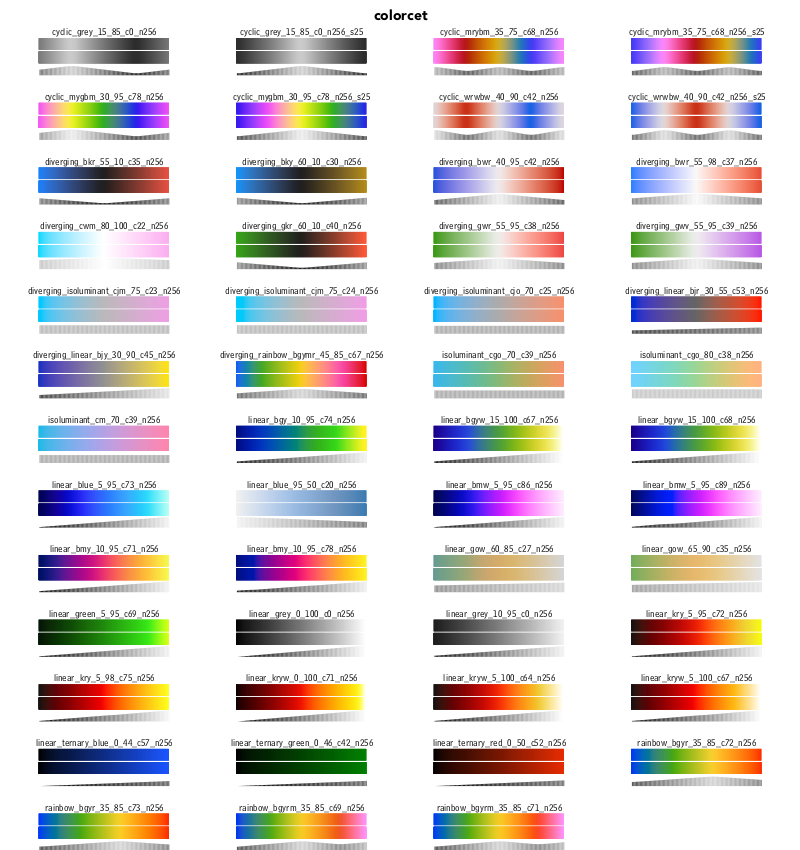
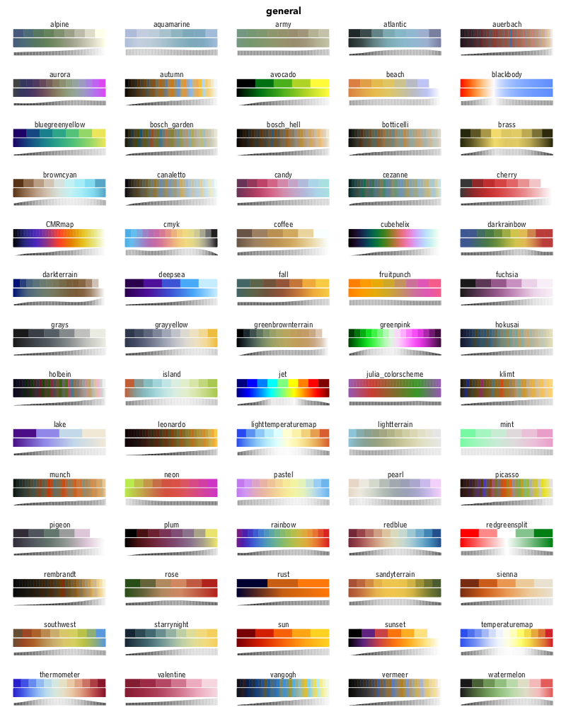

```@meta
DocTestSetup = quote
    using ColorSchemes, Colors
end
```

# Basics

## ColorScheme objects

When you start using ColorSchemes.jl, it loads a set of pre-defined ColorSchemes, and stores them in a dictionary called `colorschemes`.

A ColorScheme is a Julia object which contains:

- an array of colors
- a string defining a category
- a string that can contain descriptive notes

To access one of these built-in colorschemes, use its symbol:

```
julia> ColorSchemes.leonardo
```

If you're using Juno, for example, the colors in the colorscheme should appear in the Plots window.


Otherwise, you'll see the colors listed as RGB values:

```
32-element Array{RGB{Float64},1}:
 RGB{Float64}(0.0548203,0.016509,0.0193152)
 RGB{Float64}(0.0750816,0.0341102,0.0397083)
 RGB{Float64}(0.10885,0.0336675,0.0261204)
 RGB{Float64}(0.100251,0.0534243,0.0497594)
 ...
 RGB{Float64}(0.620187,0.522792,0.216707)
 RGB{Float64}(0.692905,0.56631,0.185515)
 RGB{Float64}(0.681411,0.58149,0.270391)
 RGB{Float64}(0.85004,0.540122,0.136212)
 RGB{Float64}(0.757552,0.633425,0.251451)
 RGB{Float64}(0.816472,0.697015,0.322421)
 RGB{Float64}(0.933027,0.665164,0.198652)
 RGB{Float64}(0.972441,0.790701,0.285136)
```

You can access the array of colors as:

```
ColorSchemes.leonardo.colors
```

By default, the colorschemes aren't imported. But to avoid using the prefixes, you can import the ones that you want:

```
julia> import ColorSchemes.leonardo
julia> leonardo
32-element Array{RGB{Float64},1}:
 RGB{Float64}(0.0548203,0.016509,0.0193152)
 RGB{Float64}(0.0750816,0.0341102,0.0397083)
 RGB{Float64}(0.10885,0.0336675,0.0261204)
 RGB{Float64}(0.100251,0.0534243,0.0497594)
 ...
 RGB{Float64}(0.757552,0.633425,0.251451)
 RGB{Float64}(0.816472,0.697015,0.322421)
 RGB{Float64}(0.933027,0.665164,0.198652)
 RGB{Float64}(0.972441,0.790701,0.285136)
```

You can reference a single value of a scheme once it's loaded:

```
leonardo[3]

-> RGB{Float64}(0.10884977211887092,0.033667530751245296,0.026120424375656533)
```

Or you can 'sample' the scheme at any point between 0 and 1 using `get()`:

```
get(leonardo, 0.5)

-> RGB{Float64}(0.42637271063618504,0.28028983973265065,0.11258024276603132)
```

```@docs
get
```

## The colorschemes dictionary

The ColorSchemes module automatically provides a number of predefined schemes. All the colorschemes are stored in an exported dictionary, called `colorschemes`.

```
colorschemes[:summer] |> show
    ColorScheme(
        ColorTypes.RGB{Float64}[
            RGB{Float64}(0.0,0.5,0.4),
            RGB{Float64}(0.01,0.505,0.4),
            RGB{Float64}(0.02,0.51,0.4),
            RGB{Float64}(0.03,0.515,0.4),
            ...
            RGB{Float64}(1.0,1.0,0.4)],
       "matplotlib",
       "sampled color schemes, sequential linearly-increasing shades of green-yellow")
```

## Pre-defined schemes

The schemes are drawn in three ways: first, showing each defined color; next, a continuous blend obtained using `get()` with values ranging from 0 to 1 (stepping through the range `0:0.001:1`); and finally a luminance graph shows how the luminance of the scheme varies as the colors change.

_It's generally agreed (search the web for "Rainbow colormaps considered harmful") that you should choose colormaps with smooth linear luminance gradients._

## cmocean

From "Beautiful colormaps for oceanography": [cmocean](https://matplotlib.org/cmocean/)



## scientific

From [Scientific colormaps](http://www.fabiocrameri.ch/colourmaps.php)



## matplotlib

From [matplot](https://matplotlib.org)



## colorbrewer

From [ColorBrewer](http://colorbrewer2.org/)



## gnuplot

From [GNUPlot](http://www.gnuplot.info)



## colorcet

["collection of perceptually accurate colormaps"](https://colorcet.holoviz.org)



## general and miscellaneous



```@docs
colorschemes
```

To choose a random ColorScheme:

```
using Random
scheme = first(Random.shuffle!(collect(keys(colorschemes))))
```

## Finding colorschemes

Use the `findcolorscheme()` function to search through the pre-defined colorschemes. The string you provide can occur in the colorscheme's name, in the category, or in the notes. It's interpreted as a case-insensitive regular expression.

```
julia> findcolorscheme("magen")

colorschemes containing "magen"

spring               (notes) sampled color schemes, linearl...
cool                 (notes) sampled color schemes, linearl...
hsv                  (notes) sampled color schemes, red-yel...

found 3 results for "magenta"
```

```
julia> findcolorscheme("cmocean")
colorschemes containing "cmocean"

oxy                  (category) cmocean
matter               (category) cmocean
dense                (category) cmocean
balance              (category) cmocean
thermal              (category) cmocean
tempo                (category) cmocean
gray                 (category) cmocean
speed                (category) cmocean
turbid               (category) cmocean
solar                (category) cmocean
ice                  (category) cmocean
haline               (category) cmocean
algae                (category) cmocean
amp                  (category) cmocean
deep                 (category) cmocean
delta                (category) cmocean
curl                 (category) cmocean
phase                (category) cmocean

found 18 results for "cmocean"
```

```@docs
findcolorscheme
```

If you prefer, you can 'roll your own' search.

```
[k for (k, v) in ColorSchemes.colorschemes if occursin(r"colorbrew"i, v.category)]
265-element Array{Symbol,1}:
 :BuPu_6
 :Spectral_4
 :RdYlGn_5
 ⋮
 :BrBG_8
 :Oranges_4
```

## Make your own ColorScheme

You can easily make your own ColorScheme objects by building an array:

```
using Colors
grays = ColorScheme([RGB{Float64}(i, i, i) for i in 0:0.1:1.0])
```

Give it a category or some added notes if you want:

```
grays = ColorScheme([RGB{Float64}(i, i, i) for i in 0:0.1:1.0],
    "my useful schemes", "just some dull grey shades")
```

although this won't end up in the `colorschemes` dictionary.

Another example, starting with a two-color scheme, then building a gradient from the first color to the other.

```
myscheme = ColorScheme([Colors.RGB(1.0, 0.0, 0.0), Colors.RGB(0.0, 1.0, 0.0)],
               "custom", "twotone, red and green")
ColorScheme([get(myscheme, i) for i in 0.0:0.01:1.0])
```

Another way is to use `loadcolorscheme()` function:

```
loadcolorscheme(:mygrays, [RGB{Float64}(i, i, i) for i in 0:0.1:1.0],
     "useful schemes", "just some dull grey shades")
```

and that will be added (temporarily).

```
julia> findcolorscheme("dull")

colorschemes containing "dull"

mygrays              (notes) just some dull grey shades...


found 1 result for "dull"
```

If you want to make more advanced ColorSchemes, use linear-segment dictionaries or indexed lists, and use functions to generate color values, see the `make_colorscheme()` function in the [ColorSchemeTools.jl](https://github.com/JuliaGraphics/ColorSchemeTools.jl) package.

## Continuous color sampling

You can access the specific colors of a colorscheme by indexing (eg `leonardo[2]` or `leonardo[5:end]`). Or you can sample a ColorScheme at a point between 0.0 and 1.0 as if it were a continuous range of colors:

```
get(leonardo, 0.5)
```

returns

```
RGB{Float64}(0.42637271063618504,0.28028983973265065,0.11258024276603132)
```


The colors in the predefined ColorSchemes are usually sorted by LUV luminance, so this often makes sense.

You can use `get()` with index data in arrays to return arrays of colors:

```
julia> get(leonardo, [0.0, 0.5, 1.0])
3-element Array{RGB{Float64},1} with eltype ColorTypes.RGB{Float64}:
 RGB{Float64}(0.05482025926320272,0.016508952654741622,0.019315160361063788)
 RGB{Float64}(0.42637271063618504,0.28028983973265065,0.11258024276603132)  
 RGB{Float64}(0.9724409077178674,0.7907008712807734,0.2851364857083522)
```


```
julia> simg = get(leonardo, rand(10, 16));
julia> using FileIO
julia> save("mosaic.png", simg)
```


## Matplotlib compatibility

Most of the color schemes in Matplotlib are available. The following list gives a general picture.

```@example
using ColorSchemes

# https://matplotlib.org/examples/color/colormaps_reference.html

matplotlibcmaps = Dict(
   :perceptuallyuniformsequential => [
      :viridis, :plasma, :inferno, :magma],
   :sequential => [
      :Greys_9, :Purples_9, :Blues_9, :Greens_9, :Oranges_9, :Reds_9,
      :YlOrBr_9, :YlOrRd_9, :OrRd_9, :PuRd_9, :RdPu_9, :BuPu_9,
      :GnBu_9, :PuBu_9, :YlGnBu_9, :PuBuGn_9, :BuGn_9, :YlGn_9],
   :sequential2 => [
      :binary, :gist_yarg, :gist_gray, :gray, :bone, :pink,
      :spring, :summer, :autumn, :winter, :cool, :Wistia,
      :hot, :afmhot, :gist_heat, :copper],
   :diverging => [
      :PiYG_11, :PRGn_11, :BrBG_11, :PuOr_11, :RdGy_11, :RdBu_11,
      :RdYlBu_11, :RdYlGn_11, :Spectral_11, :coolwarm, :bwr, :seismic],
   :cyclical => [
        :twilight, :twilight_shifted, :hsv],
   :qualitative => [
      :Pastel1_9, :Pastel2_8, :Paired_11, :Accent_8,
      :Dark2_8, :Set1_9, :Set2_8, :Set3_12,
      :tab10, :tab20, :tab20b, :tab20c],
   :miscellaneous => [
      :flag, :prism, :ocean, :gist_earth, :terrain, :gist_stern,
      :gnuplot, :gnuplot2, :CMRmap, :cubehelix, :brg, :hsv,
      :gist_rainbow, :rainbow, :jet, :nipy_spectral, :gist_ncar]
   )

for (k, v) in matplotlibcmaps
   println("$(rpad(k, 12)) $(length(v))")
   for cs in v
      try
         c = ColorSchemes.colorschemes[cs]
      catch
         println("\t$(rpad(cs, 12)) not currently in stock")
      end
   end
end
```
