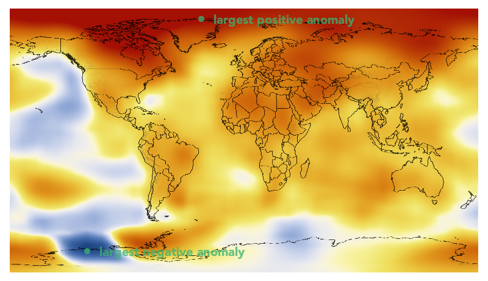

```@meta
DocTestSetup = quote
    using ColorSchemes, Colors
end
```

# Finding colors in colorschemes

ColorSchemes.jl provides the function `getinverse(cscheme, color)` which is the _inverse_ of `get(cscheme, n)`. This function returns a number between 0 and 1 that best represents the location of a color on the colorscheme's 'axis'.


```@docs
getinverse
```

## Example of using getinverse()

One example use for `getinverse()` is to convert a heatmap image into an Array of continuous values, e.g. temperature.

In this example, we will convert a heatmap image representing elevation in the United States into an Array of elevation values. The image represents global temperature anomalies averaged from 2008 through 2012, with blue as -2°C and Red as +2°C. Higher than normal temperatures are shown in red (red is +2°C) and lower than normal temperatures are shown in blue (blue is -2°C). The global surface temperature in 2012 was +0.55°C. [source](https://svs.gsfc.nasa.gov/cgi-bin/details.cgi?aid=4030).

```julia
using Images, FileIO
img = download("https://www.nasa.gov/images/content/719282main_2008_2012_printdata.1462.jpg") |> load
img = imresize(img, Tuple(Int(x) for x in size(img) .* 0.2));
display(img)
```


```julia
temps = [getinverse(ColorSchemes.temperaturemap, pixel) for pixel in img]

432×768 Array{Float64,2}:
 0.975615  0.975615  0.975615  0.975615  …  0.975615  0.975615  0.975615
 0.975484  0.975767  0.975615  0.975615     0.975615  0.975615  0.975767
 0.975615  0.975615  0.975615  0.975615     0.975615  0.975615  0.975615
 0.975615  0.975615  0.975615  0.975615     0.975615  0.975615  0.975615
 0.975615  0.975615  0.975615  0.975615     0.975615  0.975615  0.975615
 0.975615  0.975615  0.975615  0.975615  …  0.975615  0.975615  0.975615
 0.975615  0.975615  0.975615  0.975615     0.975615  0.975615  0.975615
 0.975615  0.975615  0.975615  0.975615     0.975615  0.975615  0.975615
 ⋮                                       ⋱  ⋮                           
 0.820419  0.820084  0.819388  0.819388     0.819977  0.821949  0.81973
 0.816596  0.816055  0.816055  0.816055  …  0.819388  0.819388  0.818957
 0.813865  0.813247  0.813247  0.813247     0.816055  0.815452  0.813865
 0.810015  0.809307  0.809307  0.809307     0.813247  0.812582  0.812582
 0.808566  0.805171  0.805171  0.805171     0.810015  0.810015  0.809307
 0.804418  0.801045  0.80182   0.801045     0.805171  0.805171  0.805171
 0.801045  0.802513  0.802513  0.800252  …  0.804418  0.804308  0.801045
 0.802037  0.798624  0.798624  0.798624     0.802401  0.800252  0.802848
```

The image has been converted from its original colors to an array of continuous values between 0 and 1. This makes it possible to process as data. For example, we can find the places with the greatest anomalies:

```julia
mintemp, maxtemp = argmin(temps), argmax(temps)

 (CartesianIndex(397, 127), CartesianIndex(17, 314))
```

and these maximum and minimum 'coordinates' can be displayed on the image using another package that allows you to mix images and vector graphics easily (such as Luxor.jl, for example).

```julia
save("/tmp/img.png", img)
using Luxor
pngimg = readpng("/tmp/img.png")

w, h = pngimg.width, pngimg.height

maxpt = Point(maxtemp[2], maxtemp[1]) # image and graphics coords need swapping
minpt = Point(mintemp[2], mintemp[1])

@png begin
    placeimage(pngimg, O, centered=true)
    translate(-w/2, -h/2)
    sethue("mediumseagreen")
    fontsize(20)
    fontface("Avenir-Black")
    setopacity(0.75)
    circle(maxpt, 5, :fill)
    label("largest positive anomaly", :E, maxpt, offset=20)
    circle(minpt, 5, :fill)
    label("largest negative anomaly", :E, minpt, offset=20)
end 800 460
```



We can display the array of continuous values as a grayscale image, where black is 0.0 and white is 1.0.

```julia
Gray.(temps)
```


