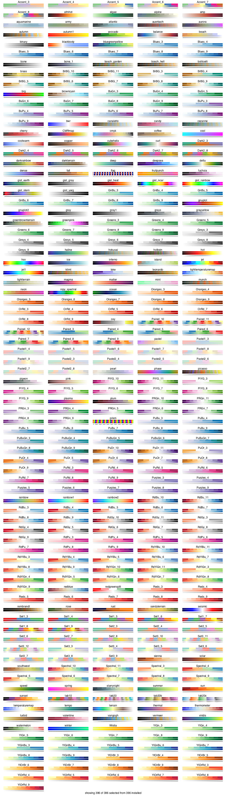

# Introduction to ColorSchemes

This package provides tools for working with colorschemes and colormaps. As well as providing many pre-made colormaps and schemes, this package allows you to extract colorschemes from images and use them in plots or other graphics programs.

This package relies on the [Colors.jl](https://github.com/JuliaGraphics/Colors.jl) package and [Images.jl](https://github.com/JuliaImages/Images.jl).

Please submit issues and pull requests.

## Current status

ColorSchemes currently runs on Julia version 0.5.

## Installation and basic usage

Install the package as follows:

```
Pkg.add("ColorSchemes")
```

and to use it:

```
using ColorSchemes
```

Original version by [cormullion](https://github.com/cormullion).

### Basics

A colorscheme is an array of colors:

    32-element Array{RGB{Float64},1}:
        RGB{Float64}(0.0548203,0.016509,0.0193152)
        RGB{Float64}(0.0750816,0.0341102,0.0397083)
        RGB{Float64}(0.10885,0.0336675,0.0261204)
        RGB{Float64}(0.100251,0.0534243,0.0497594)
        ...
        RGB{Float64}(0.85004,0.540122,0.136212)
        RGB{Float64}(0.757552,0.633425,0.251451)
        RGB{Float64}(0.816472,0.697015,0.322421)
        RGB{Float64}(0.933027,0.665164,0.198652)
        RGB{Float64}(0.972441,0.790701,0.285136)

The names of the built-in colorschemes are stored in the `schemes` array:

    julia> schemes
    336-element Array{Symbol,1}:
    :alpine         
    :aquamarine     
    :army           
    :atlantic       
    :aurora         
    :autumn         
    :avocado        
    :beach          
    :blackbody      
    ...
    :PiYG_10        
    :PiYG_11        
    :magma          
    :inferno        
    :plasma         
    :viridis

To access one of these built-in colorschemes, use its symbol:

    julia> ColorSchemes.leonardo

    32-element Array{RGB{Float64},1}:
     RGB{Float64}(0.0548203,0.016509,0.0193152)
     RGB{Float64}(0.0750816,0.0341102,0.0397083)
     RGB{Float64}(0.10885,0.0336675,0.0261204)
     RGB{Float64}(0.100251,0.0534243,0.0497594)
     ...
     RGB{Float64}(0.620187,0.522792,0.216707)
     RGB{Float64}(0.692905,0.56631,0.185515)
     RGB{Float64}(0.681411,0.58149,0.270391)
     RGB{Float64}(0.85004,0.540122,0.136212)
     RGB{Float64}(0.757552,0.633425,0.251451)
     RGB{Float64}(0.816472,0.697015,0.322421)
     RGB{Float64}(0.933027,0.665164,0.198652)
     RGB{Float64}(0.972441,0.790701,0.285136)


By default, the names of the colorschemes aren't imported (there _are_ rather a lot of them). But to avoid using the prefixes, you can import the ones that you want:

    julia> import ColorSchemes.leonardo
    julia> leonardo
    32-element Array{RGB{Float64},1}:
     RGB{Float64}(0.0548203,0.016509,0.0193152)
     RGB{Float64}(0.0750816,0.0341102,0.0397083)
     RGB{Float64}(0.10885,0.0336675,0.0261204)
     RGB{Float64}(0.100251,0.0534243,0.0497594)
     ...
     RGB{Float64}(0.757552,0.633425,0.251451)
     RGB{Float64}(0.816472,0.697015,0.322421)
     RGB{Float64}(0.933027,0.665164,0.198652)
     RGB{Float64}(0.972441,0.790701,0.285136)

You can reference a single value of a scheme once it's loaded:

    leonardo[3]

    -> RGB{Float64}(0.10884977211887092,0.033667530751245296,0.026120424375656533)

Or you can 'sample' the scheme at any point between 0 and 1 using `get`:

    get(leonardo, 0.5)

    -> RGB{Float64}(0.42637271063618504,0.28028983973265065,0.11258024276603132)

You can extract a colorscheme from an image. For example, here's an image of a famous painting:


Use `extract()` to create a colorscheme from the original image:

    monalisa = extract("monalisa.jpg", 10, 15, 0.01; shrink=2)

which in this example creates a 10-color scheme (using 15 iterations and with a tolerance of 0.01; the image can be reduced in size, here by 2, before processing, to save time).


    10-element Array{RGB{Float64},1}:
    RGB{Float64}(0.0406901,0.0412985,0.0423865),
    RGB{Float64}(0.823493,0.611246,0.234261),
    RGB{Float64}(0.374688,0.363066,0.182004),
    RGB{Float64}(0.262235,0.239368,0.110915),
    RGB{Float64}(0.614806,0.428448,0.112495),
    RGB{Float64}(0.139384,0.124466,0.0715472),
    RGB{Float64}(0.627381,0.597513,0.340734),
    RGB{Float64}(0.955276,0.775304,0.37135),
    RGB{Float64}(0.497517,0.4913,0.269587),
    RGB{Float64}(0.880421,0.851357,0.538013),
    RGB{Float64}(0.738879,0.709218,0.441082)]

(Extracting colorschemes from images requires image importing and exporting abilities. These are platform-specific. On Linux/UNIX, ImageMagick can be used for importing and exporting images.)

```@docs
extract
```

The ColorSchemes module automatically loads a number of predefined schemes, shown in the following illustration. Each scheme is drawn in three ways: first, showing each color; next, a continuous blend obtained using `get()` with values ranging from 0 to 1 (stepping through the range `0:0.001:1`); and finally a luminance graph shows how the luminance of the scheme varies as the colors change.

It's generally agreed (search the web for "Rainbow colormaps considered harmful") that you should choose colormaps with smooth linear luminance gradients.



(You can generate this file using `ColorSchemes/doc/draw-swatches.jl`, after obtaining the Luxor package to draw and label things.)

You can list the names of built-in colorschemes in the `ColorSchemes/data` directory by looking in the `schemes` symbol. Look for matches with `filter()`.

    julia> filter(x-> contains(string(x), "temp"), schemes)
    2-element Array{Symbol,1}:
     :lighttemperaturemap
     :temperaturemap

    julia> filter(x-> ismatch(r"ma.*", string(x)), schemes)
    5-element Array{Symbol,1}:
    :aquamarine         
    :lighttemperaturemap
    :temperaturemap     
    :magma              
    :plasma       

```@docs
schemes
```

Of course you can easily make your own colorscheme by building an array:

    grays = [RGB{Float64}(i, i, i) for i in 0:0.1:1.0]

or, slightly longer:

    reds = RGB{Float64}[]

    for i in 0:0.05:1
      push!(reds, RGB{Float64}(1, 1-i, 1-i))
    end

## Continuous colors

You can access the specific colors of a colorscheme by indexing (eg `leonardo[2]` or `leonardo[2:20]`). Or you can sample a colorscheme at a point between 0.0 and 1.0 as if it was a continuous range of colors:

    get(leonardo, 0.5)

returns

    RGB{Float64}(0.42637271063618504,0.28028983973265065,0.11258024276603132)

The colors in the predefined colorschemes are usually sorted by LUV luminance, so this often makes sense.

```@docs
get
```

## Sorting color schemes

Use `sortcolorscheme()` to sort a scheme non-destructively in the LUV color space:

    sortcolorscheme(ColorSchemes.leonardo)
    sortcolorscheme(ColorSchemes.leonardo, rev=true)

The default is to sort colors by their LUV luminance value, but you could try specifying the `:u` or `:v` LUV fields instead (sorting colors is another problem domain not really addressed in this package...):

    sortcolorscheme(colorscheme, :u)

```@docs
sortcolorscheme
```

## Weighted colorschemes

Sometimes an image is dominated by some colors with others occurring less frequently. For example, there may be much more brown than yellow in a particular image. A colorscheme derived from this image can reflect this. You can extract both a set of colors and a set of numerical values or weights that indicate the proportions of colors in the image.

    using Images
    cs, wts = extract_weighted_colors("monalisa.jpg", 10, 15, 0.01; shrink=2)

The colorscheme is now in `cs`, and `wts` holds the various weights of each color:

    wts
    -> 10-element Array{Float64,1}:
     0.294055
     0.0899108
     0.0808455
     0.0555576
     0.142818
     0.0356599
     0.0391717
     0.112667
     0.0596559
     0.0896584

With the colorscheme and the weights, you can make a colorscheme in which the more common colors take up more space in the scheme:

    colorscheme_weighted(cs, wts, len)

Or in one go:

    colorscheme_weighted(extract_weighted_colors("monalisa.jpg")...)

Compare the weighted and unweighted versions of schemes extracted from the Hokusai image "The Great Wave":


```@docs
extract_weighted_colors
colorscheme_weighted
```
