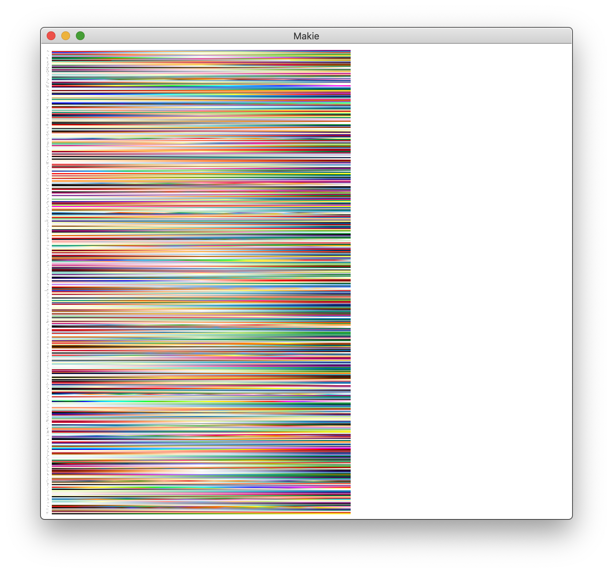

# Plotting

## UnicodePlots.jl

The `heatmap()` function in [UnicodePlots.jl](https://github.com/Evizero/UnicodePlots.jl) can use colorschemes. You have to supply the colors as an array of floating-point numbers first:

```julia
... colormap = [(x.r, x.g, x.b) for x in ColorSchemes.leonardo.colors]
```

For example:

```julia
heatmap(z::AbstractMatrix; title = "Hot!",
    colormap = [(x.r, x.g, x.b) for x in ColorSchemes.leonardo.colors])
```


## Plots.jl

[Plots.jl](https://docs.juliaplots.org/) supports all colorschemes from ColorSchemes.jl. They can be used as a gradient or as a palette and are passed as a symbol holding their name to `cgrad` or `palette`.

This renaissance-looking plot uses the `leonardo` scheme:

```julia
using Plots

x = 1:0.3:20
y = x
f(x, y) = begin
      sin(x) + cos(y)
  end
contour(x, y, f, fill=true, c = :leonardo)
```


(You can use `c` as a short cut for `seriescolor`.)

With other plots, use the `palette` keyword:

```julia
using ColorSchemes

plot(Plots.fakedata(100, 20),
      w=4,
      background_color=ColorSchemes.vermeer[1],
      palette=:vermeer)
```


## Gadfly

Here's how you can use ColorSchemes in Gadfly:

```julia
using Gadfly, ColorSchemes
x = repeat(collect(1:20), inner=[20]);
y = repeat(collect(1:20), outer=[20]);
plot(x=x, y=y,
    color=x+y,
    Geom.rectbin,
    Scale.ContinuousColorScale(p -> get(ColorSchemes.sunset, p)))
```


## Makie

If you use Makie.jl you can pass the colors in a ColorScheme directly to the `colormap` keyword.

```julia
using Makie, ColorSchemes
N = 20
x = LinRange(-0.3, 1, N)
y = LinRange(-1, 0.5, N)
z = x .* y'
image(x, y, z, colormap = ColorSchemes.picasso.colors)
```


You can display all the colorschemes using Makie by letting the code browse through the `colorschemes` dictionary:

```julia
using Makie, ColorSchemes

h = 0.0
offset = 0.1
scene = Scene()
cam2d!(scene)
plot = map(collect(keys(colorschemes))) do cmap
     global h
     c = to_colormap(colorschemes[cmap].colors)
     cbar = image!(
         scene,
         range(0, stop = 10, length = length(c)),
         range(0, stop = 1, length = length(c)),
         reshape(c, (length(c), 1)),
         show_axis = false
     )[end]
     text!(
         scene,
         string(cmap, ":"),
         position = Point2f0(-0.1, 0.5 + h),
         align = (:right, :center),
         show_axis = false,
         textsize = 0.4
     )
     translate!(cbar, 0, h, 0)
     h -= (1 + offset)
end
scene
```



## Winston

If you prefer Winston.jl for plotting, you can use ColorSchemes with `imagesc`:

```julia
using Winston, ColorSchemes
klimt = ColorSchemes.klimt.colors
Winston.colormap(klimt)
Winston.imagesc(reshape(1:10000,100,100))
```


Sometimes you'll want a smoother gradient with more colors. You can use `get(scheme, n)` to generate a more detailed array of colors, varying `n` from 0 to 1 by 0.001:

```julia
brasstones = ColorSchemes.brass
brasstonesmooth = [get(brasstones, i) for i in 0:0.001:1]
Winston.colormap(brasstonesmooth)
Winston.imagesc(reshape(1:10000,100,100))
```


## PyPlot

ColorSchemes can be used with the `cmap` keyword in PyPlot:

```julia
using PyPlot, Distributions, ColorSchemes

solar = ColorSchemes.solar.colors

n = 100
x = range(-3, stop=3, length=n)
y = range(-3, stop=3, length=n)

xgrid = repeat(x', n, 1);
ygrid = repeat(y, 1, n);
z = zeros(n, n);

for i in 1:n
    for j in 1:n
        z[i, j] = 2sin(x[i]) * 2cos(y[j])
    end
end

fig = PyPlot.figure("pyplot_surfaceplot",figsize=(10,10))

using3D()
ax = fig.add_subplot(2, 1, 1, projection = "3d")

ax.plot_surface(xgrid, ygrid, z, rstride=2,edgecolors="k",
    cstride=2,
    cmap=ColorMap(solar),
    alpha=0.8,
    linewidth=0.25)

display(fig)
```


